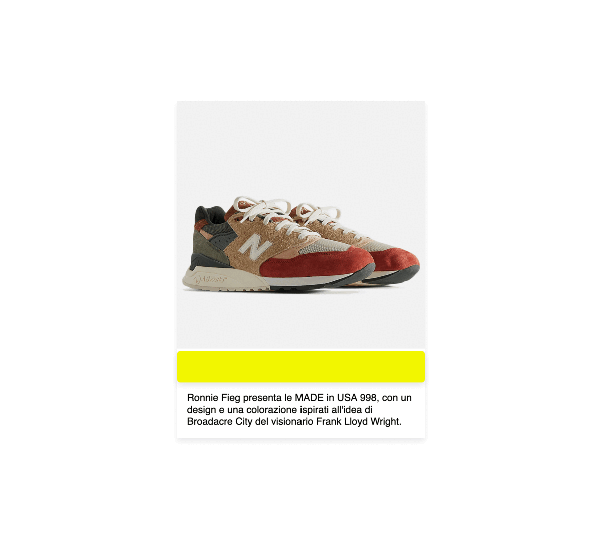

## Esercitazione 1 - E-commerce card layout

Partendo dal file `index.html` in `./problem/index.html` modificate il file di stile nella stessa cartella per replicare il layout della carta numero 2 in `assets/mock-up.pdf`.



**Non è necessario modificare la struttura HTML**, in questa esercitazione concentratevi sul CSS.:

### Obiettivi

1. Posizionare il badge giallo affinchè sia in sovrapposizione all'immagine della carta.

2. Centrare verticalmente il testo segnaposto della carta

#### Obiettivi bonus

1. Replicare le carte e costruire una griglia di _prodotti_
2. Cambiare foto e lunghezze dei testi per rendere le carte diverse tra loro e verificare la solidità del CSS scritto.

---

#### Tips

Analizzate la struttura HTML prima di iniziare a scrivere il CSS.
Procedete per step, non cercate di fare tutto in una volta.

```css
position: relative;
position: absolute;
```

```css
top: 0;
left: 0;
```

```css
display: flex;
flex-direction: column;
```
